# Keyboard Lab

A browser-based simulator for keyboard layouts and keycap colorways. Built for mechanical-keyboard enthusiasts who want to design, visualize, and iterate on custom keyboard builds entirely in the browser — no account, no server, no cloud.

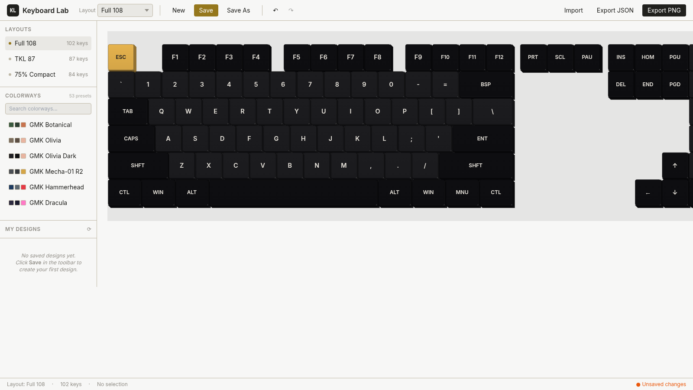

## Live Demo

**https://cj-1981.github.io/keyboard-simulator/**

## Features

### Three Layouts

Switch between the three most common enthusiast form factors on the fly:

| Layout | Keys | Screenshot |
|---|---|---|
| **Full 108** | 102 keys with numpad | 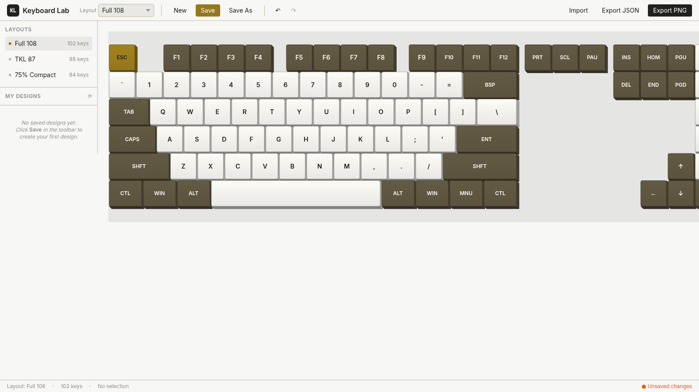 |
| **TKL 87** | 87 keys, no numpad | 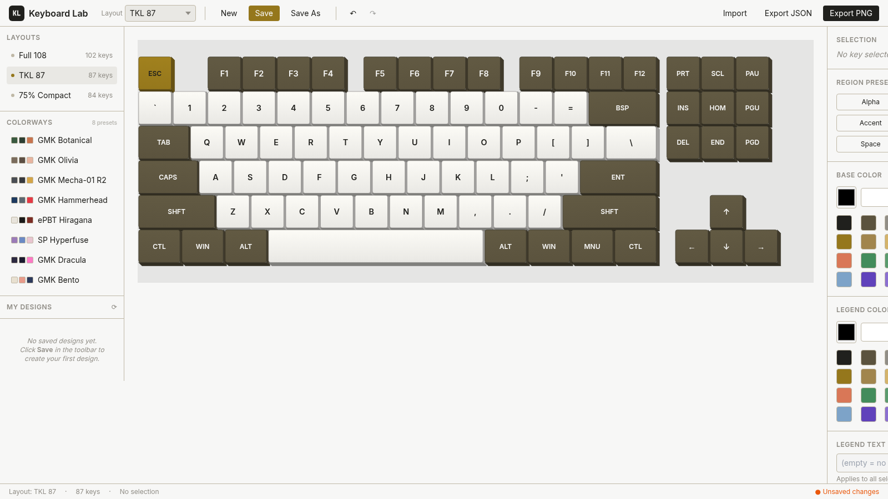 |
| **75% Compact** | 84 keys, packed function row | 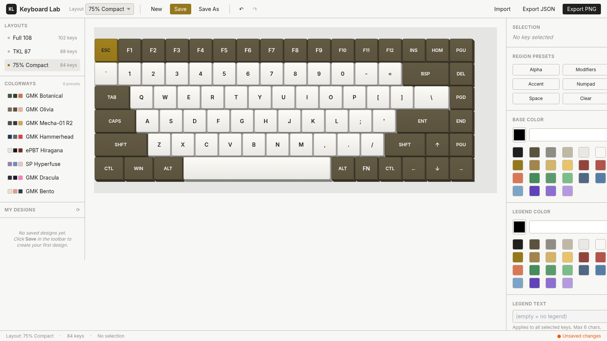 |

### Isometric 3D Keycap Rendering

Each keycap is rendered as SVG with a top-face gradient + side walls for a subtle 3D look. Click any keycap to select it; shift-click for additive multi-select.

### 53 Famous Colorway Presets

Browse a curated library of the most iconic community keycap sets, organized by manufacturer:

- **GMK** (43 sets): Botanical, Olivia, Olivia Dark, Mecha-01 R2, Hammerhead, Dracula, Bento, Mono, Noir, TA Royal Alpha, **Dolch**, **Hyperfuse**, Nautilus, Merlin, Awakening, Coral, Peach Blossom, Terramoto, Deku, **WoB**, **BoW**, Red Samurai, Bushido, Arcane, Arc, Wasabi, Kingfisher, Sky Dolch, Stripes, 70s, Hospital, Yuri, Huadiao, Modern Moscow, Paperwork, Phantom, Lavender, Caramel, Camping, Deep Navy, Olm, Metaverse, Orient
- **ePBT / PBTfans** (6 sets): Hiragana, Kobe, Mono, WoB, Void, Kayda
- **SP / Signature Plastics** (4 sets): Hyperfuse, Honeywell, Calm Depths, 1976

Each preset includes designer credits and approximate Pantone/RAL color codes. Use the built-in search box to filter by name or description.

#### Colorway Showcase

| | | |
|---|---|---|
| 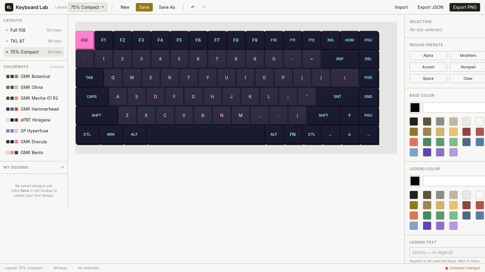 | 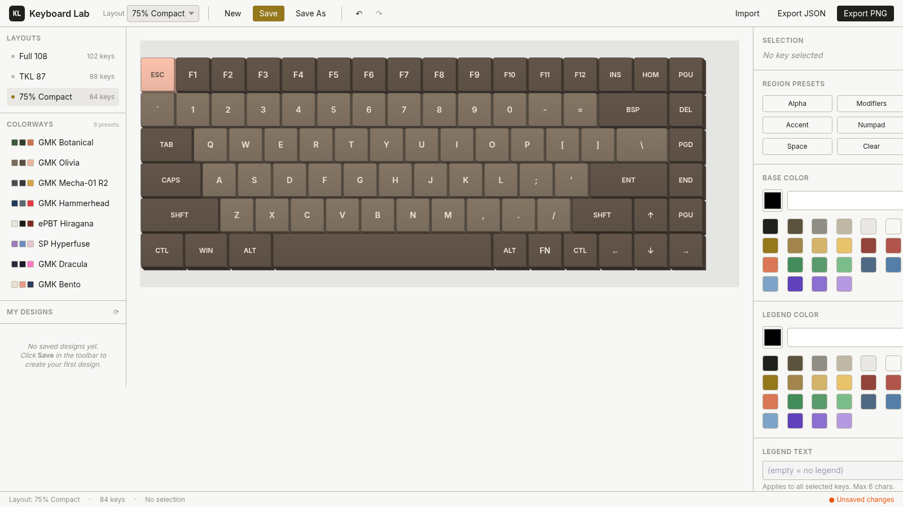 | 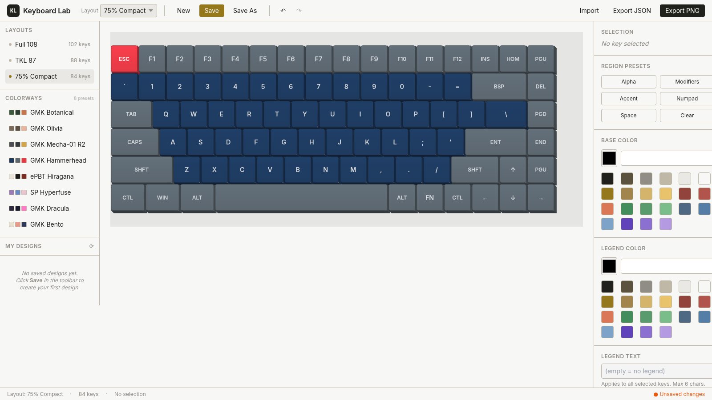 |
| **GMK Dracula** — synthwave purple & pink | **GMK Olivia** — warm grey & peach | **GMK Hammerhead** — navy & shark grey |
| 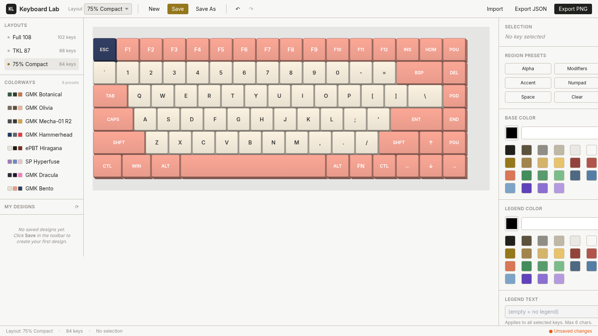 | 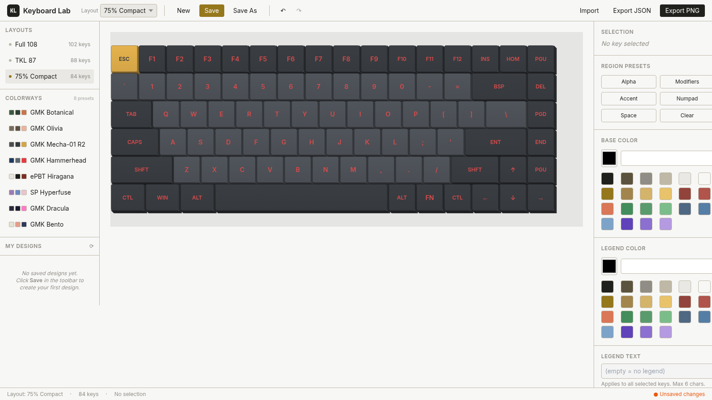 | 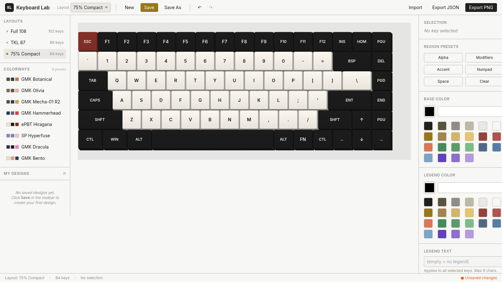 |
| **GMK Bento** — cream, salmon, navy | **GMK Mecha-01 R2** — gunmetal & gold | **ePBT Hiragana** — monochrome classic |
| 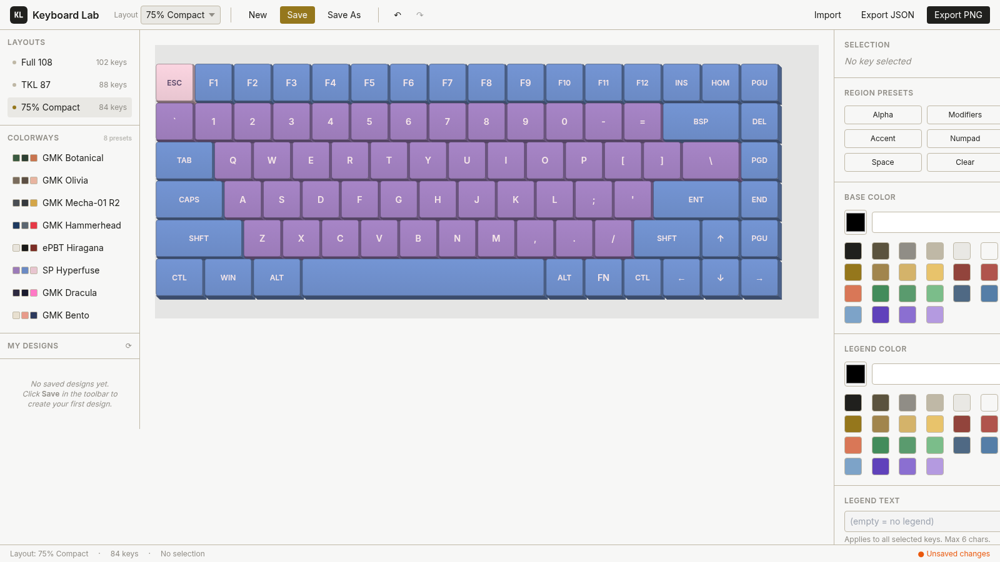 | | |
| **SP Hyperfuse** — pastel cyberpunk OG | | |

### Per-Key Customization

Select any key (or use region presets) and customize:

- **Base color** — native color picker + 24-swatch quick palette
- **Legend color** — same picker + swatch palette
- **Legend text** — up to 6 characters

### Region Presets

Bulk-select all keys in a region with one click:

- **Alpha** — main letter keys
- **Modifiers** — shift, ctrl, alt, function keys, arrows
- **Accent** — typically ESC
- **Numpad** — numeric keypad (Full 108 only)
- **Space** — spacebar

### Local Persistence

All designs are stored in **IndexedDB** — no account, no server, no cloud. Saved designs appear in the left sidebar gallery, sorted by last-modified date. Each design captures:

- User-editable name (max 80 chars)
- User-editable description (max 500 chars)
- Layout, keycap colors, legends
- Creation and modification timestamps

### Export & Import

- **PNG export** — high-resolution 2× DPI raster image for sharing on social / forum posts
- **JSON export** — full design state wrapped in a schema-versioned envelope for re-import and version control
- **JSON import** — drop in any previously-exported `.kbd.json` file

### Keyboard Shortcuts

| Shortcut | Action |
|---|---|
| `Ctrl+S` | Save (opens save dialog) |
| `Ctrl+Z` | Undo (up to 20 steps) |
| `Ctrl+Y` or `Ctrl+Shift+Z` | Redo |
| `Shift+click` | Add/remove key from selection |
| `Shift+click` colorway | Load as new design (vs. apply to current) |

## UI Tour

### Studio Layout (3-Pane)

The main interface follows the classic creative-tool pattern: left sidebar (layouts + colorways + saved designs), center canvas (SVG keyboard), right inspector (color + legend controls).

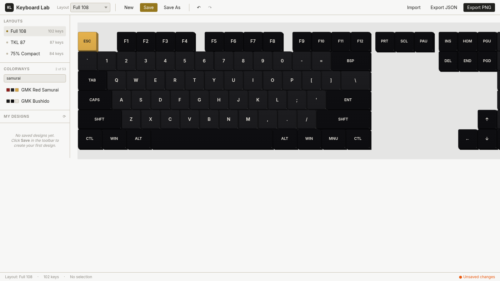

*Search the colorway library by name or description — try "olivia", "monochrome", "purple", or "samurai".*

### Inspector

Click a keycap to populate the right inspector with its current colors and legend. Edit any field to apply changes instantly (with undo support).

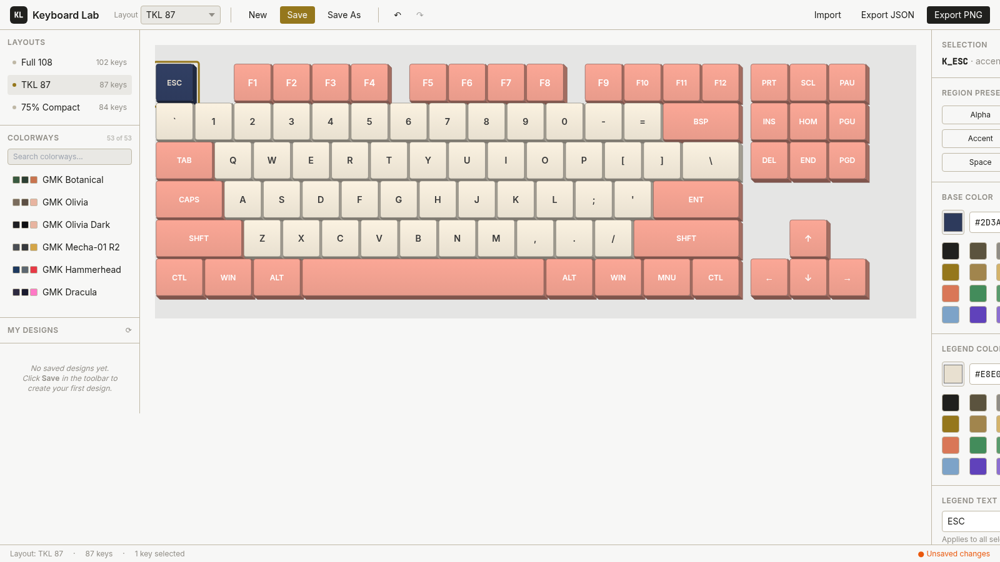

*ESC key selected on GMK Bento — inspector shows the navy accent color `#2D3A5C` ready to edit.*

## Tech Stack

- **Vanilla Vite + TypeScript** — no framework runtime, ~16KB gzipped JS
- **Tailwind CSS 3** — utility-first styling, tree-shaken to used utilities only
- **IndexedDB** (via `idb` library) — 50MB+ quota, structured storage
- **SVG + CSS transforms** — isometric 3D keycap rendering, no WebGL
- **GitHub Pages** — static hosting, auto-deploys via GitHub Actions

**Bundle size:** ~16KB gzipped total (JS 12KB + CSS 3KB + idb 1KB) — well under the 200KB budget.

## Local Development

```bash
git clone https://github.com/CJ-1981/keyboard-simulator.git
cd keyboard-simulator
npm install
npm run dev      # start dev server at http://localhost:5173
npm run build    # type-check + production build to ./dist
npm run preview  # preview the production build locally
```

## Deployment

### GitHub Pages (already configured)

1. Push to `main` — the included workflow (`.github/workflows/deploy.yml`) builds and deploys automatically
2. Site goes live at `https://<your-username>.github.io/<repo-name>/`
3. If you rename the repo, update `base` in `vite.config.ts` to `'/<new-repo-name>/'`

### Vercel / Netlify / Cloudflare Pages

Import the repo and use these settings:

- **Build command:** `npm run build`
- **Output directory:** `dist`
- **Environment variables:** none required

## Architecture

```
src/
├── main.ts                  # entry point, wires 3-pane layout
├── store/
│   ├── types.ts             # TS interfaces, constants, default colors
│   └── store.ts             # observable state + undo/redo (20-step ring buffer)
├── layouts/
│   ├── full108.ts           # hand-curated key positions (102 keys)
│   ├── tkl87.ts             # (87 keys)
│   ├── percent75.ts         # (84 keys)
│   ├── colorways.ts         # 53 famous colorway presets
│   └── index.ts             # layout registry
├── render/
│   ├── iso.ts               # isometric math (UNIT_PX, ROW_HEIGHT_PX, wall polygons)
│   └── KeyboardRenderer.ts  # SVG markup builder
├── components/
│   ├── Toolbar.ts           # top toolbar (layout picker, save, export, undo/redo)
│   ├── Sidebar.ts           # layouts + colorway presets + saved designs gallery
│   ├── Canvas.ts            # SVG render target with delegated click handler
│   ├── Inspector.ts         # color pickers, legend editor, region presets
│   └── StatusBar.ts         # layout name, key count, save status
├── persistence/
│   └── db.ts                # IndexedDB wrapper (designs + meta stores)
└── export/
    └── index.ts             # JSON envelope + PNG export at 2× DPI
```

## Project History

This project was planned and built in a single session. The full product plan, interview question bank, and three alternative UI design proposals (Studio, Compact, Pro Workbench) are documented in the original planning PDF.

**Selected approach:** Proposal A — Studio (the recommended three-pane layout).

## License

MIT
